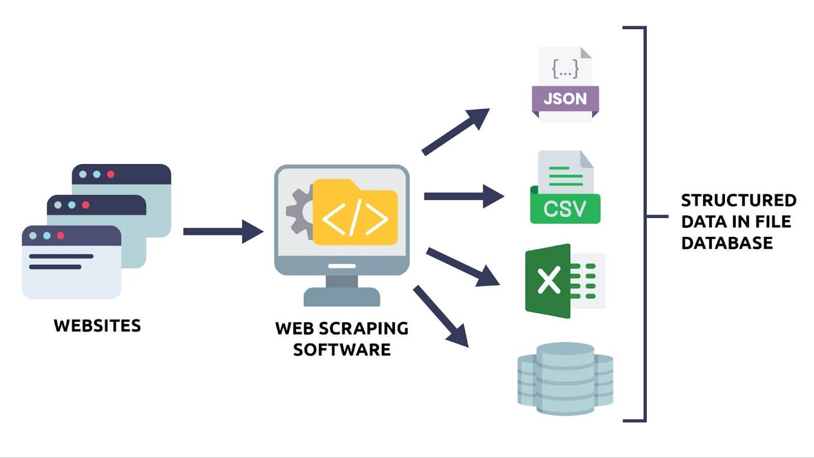

# Data Analyst

#### Technical Skills: Python, R, SQL, JSON, Tableau, PowerBI, MS Azure.
 
## Education
Bachelor of Science, Financial Engineering (_2018_)
Master of Science, Data Analytics (_2026_)

## Work Experience
**Quality Assurance Analyst @ Sonic Manufacturing Technologies (March 2025 - Present)**
- Quality reporting and process improvement, generating detailed quality performance metrics reports for management review for data-driven decision-making and continuous improvement. 
- Implementing projects to automate data collection for in-process quality checks and streamline defect resolution processes by 20%.
- Collaborating with engineering and production teams to improve product quality and process efficiency.

**Data Analyst Consultant @ Non-Profit Organization (Jan 2024 - Dec 2024)**
- Collect, process, analyze, and interpret datasets to identify trends, insights, and relationships between data.
- Develop data models, statistical summaries, dashboards, and reports to provide recommendations.
- Collaborate with cross-functional teams to conduct data quality checks and ETL processes.

**Financial Data Analyst @ Federal Government (_Jan 2018 - Dec 2023_)**
- Processed, analyzed, and interpreted complex datasets to identify trends and present insights to stakeholders.
- Data modeling and statistical analysis, to identify, evaluate, and predict risk exposure.
- SQL queries and script processes, improving code scalability and data accessibility.
- Integration of BI analytical software and implementation of data cube structures, OLAP, for better analysis reports.

**Financial Analyst @ Rentek Operational Solutions (_Sep 2015 - Dec 2017_)**
- Analyzed financial statements, credit reports, and outlined industry trends for stakeholders.
- Create reports to conduct trend analysis and enhance financial reporting capabilities.
- Automated several report processes that improved quality and accessibility of data, and reduced report generation time.

## Projects
### [Amazon Web Scraper Using Python](https://aljocastro.github.io/AmazonWebScraper/)  
This Amazon Price Tracker is a Python automation tool that monitors Amazon product prices and sends an email alert when the price drops below a defined threshold.
It uses BeautifulSoup and Requests to scrape live product data, logs each check with a timestamp for historical tracking, and leverages smtplib to deliver instant notifications.

<ins>Key Highlights:</ins>  
  🔍 Web Scraping – Extracts product title, price, and other key details directly from Amazon product pages.  
  ⏱ Scheduled Checks – Can run at set intervals to keep price data up to date.  
  📊 Data Logging – Saves timestamps and price history, can be used for trend analysis.  
  📧 Email Alerts – Notifies you instantly when the price drops below your desired limit.  
  🛠 Tech Stack – Python, BeautifulSoup, Requests, smtplib.

### D
[Publication](https://www.)

Used **Python** to train 

## Talks & Lectures
